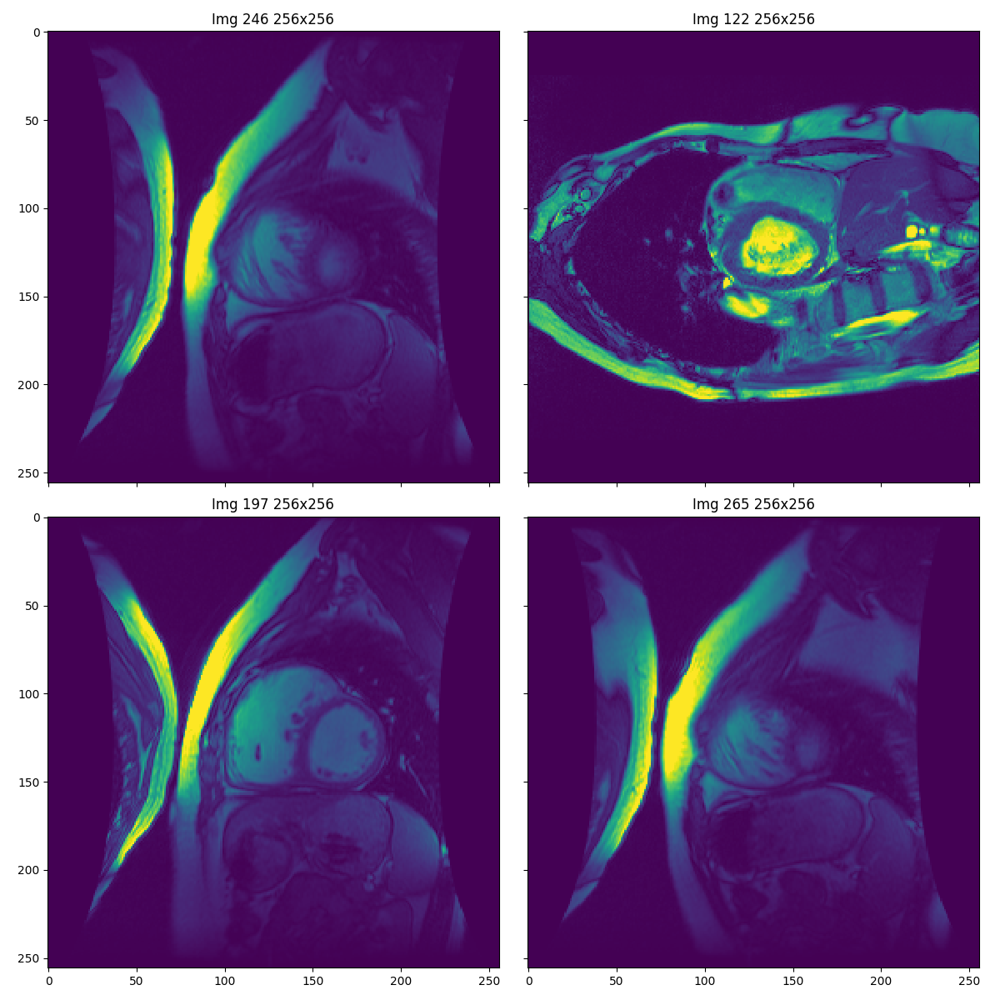

# Segmentación del miocardio en imágenes de resonancia magnética 
Proyecto del curso EL4106-Inteligencia Computacional de la Universidad de Chile. 

Descripción del proyecto:

En el marco del curso de inteligencia computacional del departamento de Ingeniería Eléctrica de la facultad de ciencias físicas y matemáticas de la Universidad de Chile se busca lograr la segmentación del miocardio usando imágenes de resonancia magnética. La motivación del proyecto se basa en poder generar una herramienta de utilidad en el ámbito de procesamiento de imágenes biomédicas a la vez de poder implementar algoritmos del área de Deep Learning. La automatización del proceso de segmentación de las imágenes corresponde a un proceso difícil debido a la variabilidad de las condiciones fisiológicas de los pacientes, la tecnología para adquisición de los datos, entre otros.

Semestre primavera 2019.

Integrantes:

- Ignacio Zurita T.
  Correo: ignacio.azt@gmail.com
  
- Rudy García A.
  Correo: rudy.garcia@ug.uchile.cl
  
